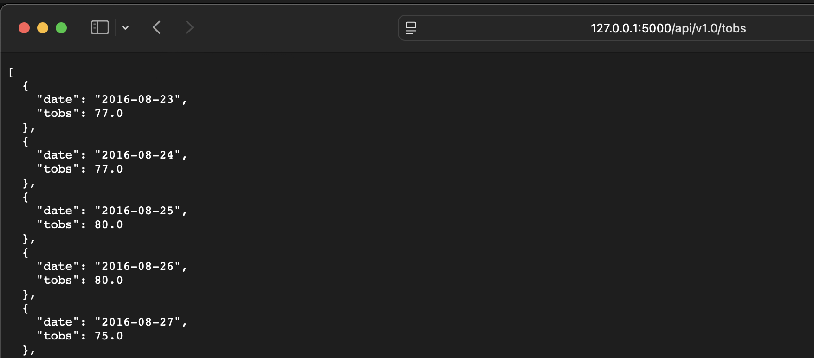

# sqlalchemy-challenge
SurfsUp: Climate Analysis and Flask API

## Contents
1. [Overview](#1-overview)  
2. [Repository](#2-repository)  
3. [Deployment](#3-deployment)  
4. [Data Analysis](#4-data-analysis)  
5. [Flask API](#5-flask-api)
6. [References](#6-references)  


## 1. Overview
This challenge analyses climate data for Honolulu, Hawaii, to aid in planning a holiday trip. It uses Python, SQLAlchemy, Pandas, Matplotlib, and Flask to explore historical weather data, perform precipitation and station analyses, and provide a Flask API for dynamic data retrieval. The analysis includes precipitation trends, station activities, and temperature observations, alongside API endpoints for data access.


## 2. Repository

### Structure
- Main Folder: [`surfs_up/`](surfs_up)
  - Jupyter Notebook: [`surfs_up/climate.ipynb`](surfs_up/climate.ipynb)
  - Python Application: [`surfs_up/app.py`](surfs_up/app.py)
  - [`surfs_up/resources/`](surfs_up/resources):
    - `surfs_up/resources/hawaii_measurements.csv`
    - `surfs_up/resources/hawaii_stations.csv`
    - `surfs_up/resources/hawaii.sqlite`


## 3. Deployment
To deploy and run this challenge:
1. Clone the repository and navigate to the `surfs_up/` directory.
2. Ensure the following Python libraries are installed:
   - Matplotlib
   - Pandas
   - NumPy
   - SQLAlchemy
   - Flask
   - pprint
   - datetime
3. Open [`surfs_up/climate.ipynb`](surfs_up/climate.ipynb) on Jupyter Notebook for data analysis.
4. To access the API, launch the Flask application
   - Navigate to the `surfs_up/` directory and run the following command in the Terminal:

   ```
   python app.py
   ```
   - Access the Flask API at http://127.0.0.1:5000 .


## 4. Data Analysis
The challenge analyses the following datasets:
- **Precipitation Data**: Trends over the past 12 months.
- **Station Data**: Active stations and their temperature observations.
- **Temperature Observations (TOBS) Data**: Minimum, maximum, and average temperatures for the most active station.


## 5. Flask API
1. `/`
- Start at the homepage.
- List all the available routes.
2. `/api/v1.0/precipitation`
- Convert the query results from your precipitation analysis (i.e. retrieve only the last 12 months of data) to a dictionary using date as the key and prcp as the value.
- Return the JSON representation of your dictionary.
3. `/api/v1.0/stations`
- Return a JSON list of stations from the dataset.
4. `/api/v1.0/tobs`
- Query the dates and temperature observations of the most-active station for the previous year of data.
- Return a JSON list of temperature observations for the previous year.
5. `/api/v1.0/<start>` and `/api/v1.0/<start>/<end>`
- Return a JSON list of the minimum temperature, the average temperature, and the maximum temperature for a specified start or start-end range.
- For a specified start, calculate `TMIN`, `TAVG`, and `TMAX` for all the dates greater than or equal to the start date.
- For a specified start date and end date, calculate `TMIN`, `TAVG`, and `TMAX` for the dates from the start date to the end date, inclusive.



## 6. References
Menne, M.J., I. Durre, R.S. Vose, B.E. Gleason, and T.G. Houston, 2012: An overview of the Global Historical Climatology Network-Daily Database. Journal of Atmospheric and Oceanic Technology, 29, 897–910. [View the article](https://journals.ametsoc.org/view/journals/atot/29/7/jtech-d-11-00103_1.xml)
